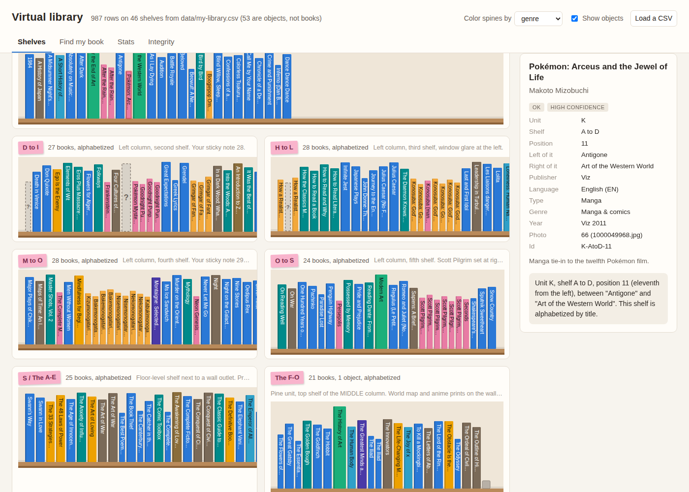

# Virtual library

A local, single-page web app that turns the library catalog workbook into a browsable virtual library: every bookcase (unit) is a section, every shelf a card with its name on a pink sticky tag, every item a spine drawn in position order. Clicking a spine shows the whole catalog row. "Find my book" searches title, author, publisher and notes and answers with the unit, shelf, position and the two neighbors. A stats dashboard charts authors, languages, decades, genres, types, status and confidence. Integrity checks flag books out of alphabetical order on the pine bookcase, books outside their shelf's letter range, Harvard Classics volumes out of order or missing, doubled or skipped positions, rows worth a second look, and titles that appear twice. Everything runs in the browser from one CSV file. No build step, no packages, no network.



## From the workbook to the page

The catalog is an Excel workbook (`catalog.xlsx`) with a `Library` sheet, one row per item photographed on a shelf, a `Descriptions` sheet with a year and a short description per item, and a `Shelves & photos` sheet describing each shelf. `import_xlsx.py` turns it into the CSV the page reads:

```
cd /home/user/side-projects/01-virtual-library
pip install openpyxl          # once
python3 import_xlsx.py /path/to/catalog.xlsx
```

This writes `data/my-library.csv` (987 rows, 46 shelves for the current workbook). That file is listed in `.gitignore` and is never committed, because the workbook carries personal notes. The page tries it first; when it is absent, the committed sample `data/library.csv` (155 invented rows in the same schema) is shown instead; when neither can be fetched (the page opened as a file), a file picker appears. Add `?catalog=sample` to the page URL to see the sample even when the real export exists. When the real export is absent, the browser logs one 404 for it in the console before the sample loads; that is expected.

## The CSV columns

All columns of the `Library` sheet are kept with their original headers, then five are added. Column order does not matter and the header row must be present.

| Column | Meaning |
|---|---|
| `ID` | Unique row id, for example `K-AtoD-11`. Used to link findings and search results to spines. |
| `Unit` | The bookcase: `A`, `B`, `D`, `F`, `G`, `H`, `I`, `J`, `K`, `L`, `M`, `N` or `Loose`. Units become sections in the shelf view, in the order they first appear. |
| `Shelf` | Shelf name as a string: `A1`, `Cubby`, `JP floor shelf`, `N4 (バガボンド, くず)`, `L1 (sticky 16)`. On the pine bookcase the names are letter ranges: `A to D`, `S / The A-E`, `The F-O`, `T-W`, plus `HC 1-16`, `HC 17-34`, `HC 35-51` for the Harvard Classics. |
| `Pos (L to R)` | Position on the shelf counted from the left, starting at 1. |
| `Title` | Title as read from the spine. Unreadable rows carry a description instead, such as `(unreadable) tan cloth spine`. |
| `Author / Editor` | Free text, may be blank. |
| `Publisher / Series` | Free text. A publisher containing `文庫` or `Bunko` marks a pocket-size book for spine sizing. |
| `Language` | `EN`, `JA`, `DE`, `IT`, `LA`, `VI`, `?`, blank, or combinations like `EN/JA`. Combined values are split for the stats. |
| `Type` | 46 values (`Fiction`, `Manga`, `Light novel`, `Art`, `Textbook`, `Anthology`, `Reference`, ...). Sets the spine size band. |
| `Photo #`, `Photo file(s)` | Which photo the row was read from. Shown in the detail panel. |
| `Left neighbor`, `Right neighbor` | Titles of the items on either side, or `(shelf start)` and `(shelf end)`. Used by "Find my book". |
| `Status` | `OK`, `Partial`, `Unreadable` or `Not a book` (games, CDs, boxes, ornaments). |
| `Confidence` | `High`, `Medium` or `Low`. |
| `Notes` | Free text, searchable. |
| `Genre` | 22 values, used for spine color by default. |
| `Year` | Added by the importer from the `Descriptions` sheet. Free text such as `1989 (4th ed.)` or `5th c. BC`. |
| `YearParsed` | Added: the first four-digit number in `Year`, or blank. Drives the decades chart. |
| `Description` | Added from the `Descriptions` sheet. Shown in the detail panel. |
| `Shelf description` | Added from the `Shelves & photos` sheet. Shown under the shelf tag; its first sentence names the unit. |
| `sort_title` | Added, empty. Fill a cell to change where a book files in the alphabetical checks without touching its title. |

An optional `Pages` column is also recognized: when present, it overrides the Type-based spine size and the Tetris piece width.

Column names are mapped in `CONFIG.columns` at the top of `library.js` (the right-hand side is the header text; case and surrounding spaces are ignored). Nothing else needs editing if a header changes.

## How to run

Served (recommended, the page then loads the CSV by itself):

```
cd /home/user/side-projects
python3 -m http.server 8000
```

Then open <http://localhost:8000/01-virtual-library/>.

Opened directly as a file (double-click `index.html`): browsers block `fetch` on `file://`, so the page shows a file picker instead. Pick `data/my-library.csv` (or the sample) there, or paste the rows into the text box. The "Load a CSV" button in the header opens the same picker at any time.

## Using the page

- Shelves. One section per unit with the unit letter and the first sentence of its shelf description; one card per shelf with the shelf name on a pink sticky tag, in the order shelves appear in the CSV; spines in position order, left to right. Spine size follows the Type band (see Assumptions), color follows genre, type or language (selector in the header). Rows with Status `Not a book` are small grey boxes ("Show objects" hides them); `Unreadable` and `Partial` rows are dashed grey spines with a question mark. Click any spine for the full row: unit, shelf, position, neighbors, publisher, language, type, genre, year, photo, notes, status, confidence, description, and the location in words.
- Find my book. Type part of a title, author, publisher or note. Matching is case-insensitive and works for Japanese and Vietnamese. Results read like "Unit K, shelf T-W, position 12 (twelfth from the left), between "The Written World" and "This Is Your Brain on Music"." Click a result (or press Enter for the first one) to jump to the spine, outlined in red.
- Stats. Top authors (blank and `?` skipped), languages (a book in `EN/JA` counts in both), publication decades from `YearParsed`, genres, types, status and confidence, as plain SVG bars. Hover a bar for the exact number. Objects are left out of everything except the status and confidence charts.
- Integrity. Findings from `Library.integrityChecks`, with a filter button per kind and a short explanation of each kind on the page. Click a finding to jump to the book.

## The shelving order, as observed

Unit K, the pine folding bookcase, is alphabetized by title across its letter-range shelves. From the data:

- Titles sort by their full title including a leading "A" or "An": "A History of Japan" sits under A, and "An Introduction to Zen Training" shelved under I is flagged.
- Titles beginning with "The " form their own block after S: the shelf "S / The A-E" holds the end of S and the start of the block, then "The F-O", "The P-T", and "T-W" starts with the last "The" titles before the plain T titles.
- Case and accents are ignored; titles starting with a digit ("1984") sort before A.
- Some books are filed by a keyword rather than the first word ("Pokémon: Arceus and the Jewel of Life" under Arceus, the Monogatari novels together under M). The checks flag these; filling `sort_title` with the keyword accepts them.

`Library.titleSortKey` implements this: it lowercases the title, strips accents, and replaces a leading "The " with the prefix `s{`, which sorts after every S title and before every T title. `sort_title`, when filled, replaces the title for ordering only.

The Harvard Classics shelves (`HC 1-16`, `HC 17-34`, `HC 35-51`) are in volume order, checked numerically.

## What each integrity check means

| Kind | Meaning |
|---|---|
| `out-of-order` | On a letter-range shelf of the alphabetized unit, the book is not part of the longest run of titles in shelving order, so it (not its neighbors) is the one to move. Only rows with Status `OK` take part; objects and unread rows have descriptions instead of titles. |
| `outside-range` | The book's sort key does not fall in the letter range parsed from its shelf name. Because consecutive names overlap ("D to I", "H to L") or leave a gap ("The P-T" then "T-W"), the accepted span runs from the end letter of the previous shelf to the start letter of the next. Usually a book filed by a keyword. |
| `hc-order`, `hc-missing`, `hc-duplicate` | Harvard Classics volumes on the HC shelves are not in numeric order, some of volumes 1 to 51 are absent from those shelves, or a volume number appears twice. |
| `position-gap`, `duplicate-position` | Positions on a shelf should run 1, 2, 3 with nothing skipped and nothing doubled. Objects count, since they occupy positions. |
| `second-look` | Status `Unreadable` or `Partial`, or Confidence `Low`, with the Notes text. Worth a look at the shelf. |
| `possible-duplicate` | The same title (case and accents ignored) in more than one place, with every location listed. |
| `missing-title`, `missing-shelf`, `missing-position`, `duplicate-id` | An empty field the shelf view needs, or a repeated id. |

On the current workbook the checks report 46 out of order, 17 outside range, 74 second look and 13 possible duplicates; no position gaps, no duplicates, all 51 Harvard Classics volumes present and in order. The sample catalog plants one of each: "Moby-Dick" on shelf "A to D", "The Trial" filed under T, Harvard Classics volume 25 missing and 29 after 30, two rows at position 5 on shelf A2, a skipped position on N1 (Uffizi), and a second "Beloved".

## File layout

```
01-virtual-library/
  index.html          the app: markup, stylesheet and page logic in one file
  library.js          shared helpers (parsing, ordering, spine drawing, checks)
  import_xlsx.py      workbook to data/my-library.csv
  data/library.csv    sample catalog in the real schema, 155 rows, 15 shelves
  data/my-library.csv the real export (gitignored, made by import_xlsx.py)
  .gitignore          keeps data/my-library.csv out of the repository
  screenshot.png      shelf view, for this README
  README.md
```

`library.js` is a plain script with no dependencies that defines one global, `Library`. Projects 14 (bookshelf poster) and 17 (Bookshelf Tetris) load it with `<script src="../01-virtual-library/library.js"></script>`. Its main functions:

| Function | What it does |
|---|---|
| `parseCSV(text)` | CSV or TSV text to row objects keyed by header. Quoted fields, CRLF and BOM are handled. |
| `normalizeRows(rows)` | Row objects to typed records using `CONFIG.columns`: `unit`, `shelf`, `position`, `title`, `languages` (split), `year` (integer), `isObject`, `isUnread`, and so on. |
| `titleSortKey(title)`, `sortKeyOf(book)` | The shelving order described above; `sortKeyOf` honors `sort_title`. |
| `parseShelfRange(name)` | `"S / The A-E"` to letter-range segments with sort-key bounds. |
| `isAlphabetizedShelf(book)` | Whether the book's shelf is checked for alphabetical order (see `CONFIG.alphabetized`). |
| `groupByShelf(books)`, `groupByUnit(books)` | Groups in order of first appearance, books by position. |
| `sizeBand(book)`, `spineGeometry(book, options)` | `small`, `medium`, `large` or `object`; width, height and color for a spine. |
| `drawSpine(svgParent, book, x, y, options)` | Draws one spine (or grey box, or dashed "?" spine) and returns the `<g>`. |
| `integrityChecks(books)` | `[{ kind, message, book }]` findings. |
| `stats(books)` | Counts by author, language, decade, genre, type, status and confidence. |
| `describeLocation(book)` | The location in words, with neighbors. |
| `catalogUrls(prefix)`, `loadFirstCatalog(urls)` | The file list (real export, then sample, honoring `?catalog=`) and a loader that tries them in turn. |

## Assumptions

- Spine sizes come from the Type column because the catalog has no page count. `CONFIG.spine.typeBands` in `library.js` maps types to three bands: `small` (Manga, Light novel, Comics, Poetry, Magazine, ...), `large` (Art, Textbook, Reference, Anthology, Nursing & medical, Test prep, ...) and `medium` for everything else; a publisher matching `文庫` or `Bunko` also means `small`. A deterministic variation of a few percent per row keeps shelves from looking like identical blocks. If a `Pages` column is added, it overrides the band.
- Which shelves are alphabetized is `CONFIG.alphabetized`: unit `K` and any shelf whose name matches the letter-range pattern (`A to D`, `T-W`, `S / The A-E`, `The F-O`). The `HC`, `JP-1`, `JP-2` and `Top (VN boxes)` shelves of unit K are not checked. Replace the regular expression with an array of shelf names to pick shelves by hand, or set `unit` to `null` to check letter-range shelves in every unit.
- Order is checked within each shelf, not across shelf boundaries; the range check covers a book that landed on the wrong shelf.
- `sort_title` is the override for books filed by a keyword. It changes ordering and the range check only; display and search still use the title.
- Only rows with Status `OK` take part in the order, range and duplicate checks. Unreadable and Partial rows are listed under `second-look` instead.
- The unit description shown in a section header is the first sentence of the first shelf's description in that unit (for example "Pine folding bookcase (natural wood, hinged sides)."), which is how the workbook's shelf descriptions read.
- Positions are expected to be consecutive; a skipped number is reported as a gap.
- Non-Latin titles sort after Latin ones by code point. The Japanese shelves are not alphabetized, so this only matters if a Japanese title lands on a letter-range shelf.
- The sample data is invented for demonstration: real titles, guessed shelves, publishers and years.

## Ideas for later

- A "where does this go" mode: type a new title and see which shelf and position it belongs to on the pine bookcase.
- A checklist mode for a physical audit: walk along a shelf and tick spines off, then report what is missing.
- Filters on the shelf view (language, genre, decade, confidence) that dim everything else.
- Show the shelf photo next to the detail panel when the photo files are copied into a local folder.
- Read the workbook directly in the browser (SheetJS or a small xlsx parser) so the import step disappears.
