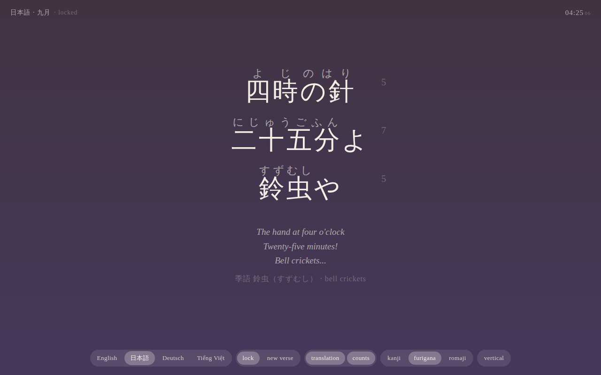

# Multilingual haiku clock

A full-screen page that shows the current time as a haiku. Every minute a new verse is composed from word banks and templates (no model, no network), and the language rotates every 20 seconds between English, Japanese, German and Vietnamese, or stays put when locked. Each verse carries a seasonal word (kigo) for the current month, taken from a per-language, per-month bank: saijiki words for Japanese, and equivalent seasonal words and festivals for the other three. Japanese verses are strict 5-7-5 morae, Vietnamese verses are exact 5-7-5 words (one word per syllable), English and German are 5-7-5 by the hand-counted syllables in their banks. The background gradient follows the hour: night, dawn, day, dusk. The same minute gives the same verse on every refresh; "new verse" reshuffles it.



## How to run

Open `index.html` directly (double-click, or `file://` in the browser). No server is needed, but serving works too:

```
cd /home/user/side-projects
python3 -m http.server 8000
```

Then open <http://localhost:8000/10-haiku-clock/>.

Controls (all also on the keyboard):

| Control | Key | What it does |
|---|---|---|
| English, 日本語, Deutsch, Tiếng Việt | left, right arrows, or click the verse | pick a language; the 20 second rotation restarts |
| lock | L | stop rotating languages |
| new verse | N or space | another verse for the same minute (a different seed) |
| translation | T | English rendering underneath, plus the season word with its gloss |
| counts | C | morae, syllables or words per line (also shown when hovering a line) |
| kanji, furigana, romaji | | Japanese reading aid |
| vertical | V | Japanese in vertical writing (`writing-mode: vertical-rl`) |

Settings are kept in `localStorage` for the browser only. No fonts or scripts are loaded from the network: the page asks for Noto Serif and the usual system mincho faces and falls back to any serif.

Tests:

```
node test.js                  # banks and generator, no browser, about 30 seconds
python3 verify_browser.py     # Playwright: file:// load, every control, console errors, screenshot.png
```

## How a verse is made

`haiku_data.js` holds the banks and the generator; `index.html` is only the clock and the display.

1. The time is turned into a few candidate expressions (forms), each a set of named chunks with a count: for Japanese `HOUR` + `MIN` (三時 / 十五分), `HALF` (三時半), `TOH` + `REM` (四時まで / 十五分, "fifteen to four"), `HALF` + `AFTER` (十時半 / 一分後); for the other languages one `TIME` chunk in several spellings ("quarter past three", "Viertel nach drei", "ba giờ mười lăm", "bốn giờ kém mười lăm"). Each form may also carry a period word that fits the hour (朝の, at night, am Abend, chiều).
2. A kigo for the month is drawn with the minute's seed.
3. Every template is a 5-7-5 skeleton of slots, for example `[HOUR ~T] [MIN ~T] [KIGO ~K]` or `[KIGO ~K] [TIME ~T] [P5]`. `~T` and `~K` are fill slots (particles, kireji like や, かな, けり, small phrases) chosen so that the line sums to exactly 5 or 7; `P5` and `P7` are whole connecting lines from a phrase bank. A template is valid when all three lines can be filled exactly, and the generator picks one valid (form, template) pair and one filling per line with the seeded random generator.
4. The translation is assembled from the same structure: every bank entry has an English gloss, and fills that follow a word carry a pattern such as `the window at {w}` or `ah, {w}`, so each line's gloss is built from the template's slot order and the chosen words.

Japanese counts are checked by a mora counter in the script (small ゃゅょ merge with the previous kana, っ counts one, ー counts one, ん counts one). The test recounts every bank entry and every generated line; the page also recounts the banks at load and warns in the console if anything disagrees.

Two Japanese minute spellings exist only because the standard ones are 8 morae (三十一分 さんじゅういっぷん) and fit no line: minutes 31 to 49 can be written as "half past, N minutes on" (十時半 / 一分後), and, only when the hour itself fills a line (十一時), 四十 takes the older reading しじゅう (as in 四十九日). All other readings are the everyday ones: 四時 よじ, 七時 しちじ, 九時 くじ, 半 はん, 十分 じゅっぷん, 一分 いっぷん, 六分 ろっぷん, 八分 はっぷん, 分 ふん/ぷん by the usual rules.

## File layout

```
10-haiku-clock/
  index.html          the clock page (layout, gradient, controls)
  haiku_data.js       word banks, templates, counters, romaji, generator (shared by page and test)
  test.js             node test: recounts banks, generates 95k verses across all months and minutes
  verify_browser.py   Playwright check of the page and the screenshot
  screenshot.png
  README.md
```

## Assumptions

- Hours are spoken in 12-hour form in all four languages, with optional period words instead of AM/PM. Midnight is 十二時 / twelve / zwölf / mười hai giờ.
- Vietnamese seasonal words follow the northern calendar (Hanoi): Tết words in January and February, hoa sữa in October, gió heo may in September and October. Southern words such as hoa mai are in February.
- English and German syllable counts are hand-counted in the banks (there is no dictionary in the page); the test only checks that they add up. Japanese and Vietnamese are recounted mechanically.
- The seed is the local date and minute, so two browsers in the same time zone show the same verse in the same minute. "New verse" adds a counter that resets on reload.
- Kireji: や and よ can end any line, かな closes a line after a noun, けり appears only inside fixed phrases (なりけり, なりにけり). The particles の, に, は never end the last line.
- Language rotation is 20 seconds (`ROTATE_MS` at the top of the script in `index.html`).

## Ideas for later

- Weight templates so the more natural forms (kigo first, time in the middle) appear more often.
- A "today" mode that prints the whole day as a 1440-verse scroll for a chosen language.
- Sound: a soft chime at the minute change, off by default.
- Let the season word follow the old lunar calendar for Japanese (二十四節気) instead of the Gregorian month.
- Add a fifth language by adding one block to `haiku_data.js` (forms, banks, kigo) and one name to `LANG_ORDER`.
