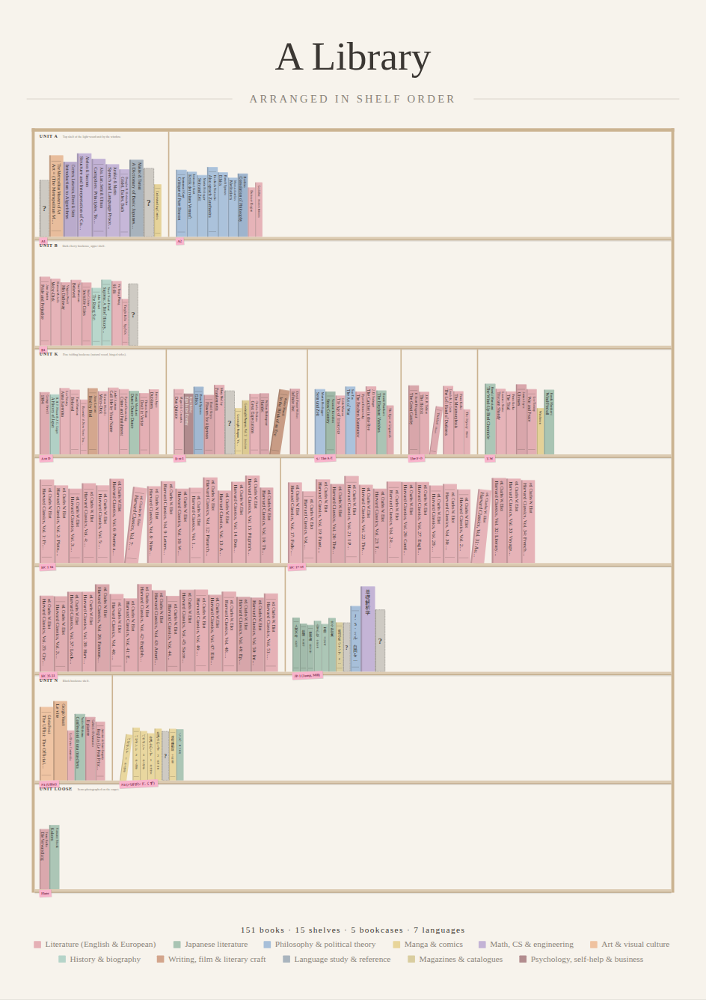

# Bookshelf poster

A printable companion to the virtual library (project 1). The page draws the whole catalog as one SVG poster: every book is a spine, spines stand on shelves in shelf order (positions left to right), shelves are grouped by bookcase with the unit letter as a section label, and each shelf hangs its name on a pink sticky note. Spine height and width follow the size band of the book's Type (or the page count, when the catalog has one), and color follows genre, type or language. The bookcase is scaled so that any number of books fills the chosen paper (A2, A1, A0, 24 x 36 in or a custom size). The result downloads as a standalone SVG with its size in millimetres, prints at scale from the browser, or copies to the clipboard as a 150 dpi PNG. No build step, no packages, no network.



## How to run

Served (recommended, the page then loads the catalog by itself):

```
cd /home/user/side-projects
python3 -m http.server 8000
```

Then open <http://localhost:8000/14-bookshelf-poster/>.

The page tries `../01-virtual-library/data/my-library.csv` first (the real export, made with `python3 import_xlsx.py catalog.xlsx` in project 1 and never committed), then the sample `../01-virtual-library/data/library.csv`. Add `?catalog=sample` to the URL to force the sample. When the real export is absent the browser logs one 404 for it before the sample loads; that is expected.

Opened directly as a file (double-click `index.html`): browsers block `fetch` on `file://`, so the page asks for the CSV instead. Pick the export (or the sample) with the file input at the top of the sidebar. The same input replaces the catalog at any time.

The catalog format is the one documented in `../01-virtual-library/README.md`: the workbook's `Library` columns (`ID`, `Unit`, `Shelf`, `Pos (L to R)`, `Title`, `Author / Editor`, `Publisher / Series`, `Language`, `Type`, `Status`, `Confidence`, `Notes`, `Genre`, ...) plus `Year`, `YearParsed`, `Description`, `Shelf description` and `sort_title` from the importer. Column names are mapped in `CONFIG.columns` of `../01-virtual-library/library.js`; this project reuses that file and does not copy it.

## Controls

All controls sit in the sidebar, which is hidden when printing.

- Paper: A2, A1, A0, 24 x 36 in, or custom width and height in mm; portrait or landscape.
- Title and subtitle: free text, drawn in the header. Default "A Library" and "Arranged in shelf order". Leave either empty to drop it.
- Font: three named stacks (Georgia serif, Helvetica sans, Menlo mono), each ending in a Japanese family so kanji titles render cleanly. Fonts are named in the SVG, not embedded.
- Color spines by genre, type or language, and a palette: muted pastels, ink on cream, or deep jewel tones (dark paper). Colors go to values in order of frequency, so the largest group gets the first color; the legend in the footer says which is which. For language, a combined value such as `EN/JA` is colored by its first language.
- Show authors: the author is added in a smaller size on a second line when the spine is wide enough, or after the title when both fit; otherwise it is left out.
- Show pink shelf tags: a sticky note with the shelf name hangs on the front edge of each shelf. Its width follows the name, long names are shortened with an ellipsis. A shelf too wide for one row continues on the next row with the same name and a small arrow.
- Show unit labels: "UNIT K" and the first sentence of the unit's description, in the clearance above the first row of each bookcase.
- Wobble seed: slight height jitter, tiny color variation, thin binding rules on some books, and a few books leaning on their neighbor. The same seed always gives the same poster; Shuffle picks a new one.
- Download SVG: saves `<title>-<paper>.svg`, a standalone file with `xmlns`, `width`/`height` in mm and a matching `viewBox`, so it opens at scale in Inkscape, Illustrator or a print shop's viewer.
- Print: opens the browser's print dialog with `@page` set to the chosen paper and zero margins (the poster carries its own margins). "Save as PDF" there gives a file for a printer.
- Copy as PNG: renders the poster on a canvas at 150 dpi and writes it to the clipboard; if the browser refuses (no clipboard image support, or insecure origin), the PNG is downloaded instead. A2 is 2480 x 3508 pixels. A0 is 4967 x 7022 and may exceed the canvas limit of some browsers.

## How it is drawn

`Poster.render` lays out the header and footer in millimetres and the bookcase in "spine units", the units of `Library.spineGeometry` (a medium book is 132 units tall, a small one 104, a large one 164). Books are grouped with `Library.groupByUnit`; rows with Status `Not a book` are left out, and `Unreadable` or `Partial` rows become grey spines with a dashed outline and a question mark. Each unit starts a new row of shelves and carries its label; within a unit shelves are wrapped greedily into rows in the order they appear in the CSV. A binary search over the scale finds the largest millimetres-per-unit at which the rows fit between header and footer. Leftover height spreads the rows a little, and the remainder centres the block. Latin titles are rotated a quarter turn and read top to bottom; titles containing CJK characters are stacked one upright glyph per line, positioned explicitly so no viewer needs vertical writing support. Titles are cut with an ellipsis to the spine height, measured in the chosen font with a canvas.

## File layout

```
14-bookshelf-poster/
  index.html       sidebar, preview, print CSS and the wiring
  poster.js        layout, drawing and export (global `Poster`)
  verify.py        Playwright checks; also writes example-a2.svg and screenshot.png
  example-a2.svg   the sample catalog on A2, muted pastels, seed 7
  screenshot.png   the same poster as a picture
  README.md
```

The page loads `../01-virtual-library/library.js` and the catalog from `../01-virtual-library/data/`, so it must stay next to project 1.

## Verifying

```
cd /home/user/side-projects
pip install playwright        # Chromium at /opt/pw-browsers/chromium is used if present
python3 14-bookshelf-poster/verify.py
```

The script serves the repository, opens the page with `?catalog=sample`, and checks: no console errors, one spine per non-object row of the sample, the downloaded SVG parses with `xml.etree` and has the expected root, size and viewBox, print media hides the sidebar and sets the poster to 420 mm, print to PDF works, the PNG renders at 2480 x 3508, every palette and a landscape 24 x 36 render without errors, and shelf name tags and unit labels are present. When `01-virtual-library/data/my-library.csv` exists it also opens the page without the query, checks that the real catalog is drawn (934 spines for 987 rows) and that its SVG downloads and parses. It writes scratch images to `cache/` or to `$POSTER_SCRATCH`.

## Assumptions

- The catalog columns and the shelving conventions are those of project 1. Nothing here needs editing when `CONFIG.columns` in `library.js` is adjusted.
- Spine sizes come from the Type band in `library.js` (`CONFIG.spine.typeBands`: manga, light novels, poetry and bunko narrow and short; art books, textbooks, reference and anthologies wide and tall; the rest medium), with three units of extra width so the thinnest spine still holds a line of text. A `Pages` column, when present, overrides the band.
- Every unit starts a new row and rows do not mix units, so a unit with two books (Loose) takes a row of its own. Units and shelves follow the order of the CSV. Books with no position sit at the end of their shelf, as `Library.groupByShelf` orders them.
- Objects (`Not a book`) are not drawn and not counted in the footer; unreadable and partial rows are drawn grey so shelf lengths stay true.
- Spine sizes are relative, not to scale: the poster is filled whatever the count, so 150 books give large spines and 934 give small ones. On A2 with the full catalog, spine text is roughly 4 pt; A1 or A0 are better for the whole collection. The proportions live in the `U` table at the top of `poster.js`.
- Genre, type and language colors are assigned by frequency, not fixed per value as in project 1, so that each palette stays balanced. To pin a genre to a color, reorder the `spines` list of the palette in `poster.js`.
- Print margins are zero and the poster keeps a margin of 4.5 percent of the shorter side inside the artwork. A print shop that needs bleed can scale the SVG in its own software.
- The SVG names fonts but does not embed them. A shop's viewer without Georgia falls through the stack to a serif of its own; the layout allows four percent of slack for that.

## Ideas for later

- One poster per bookcase (unit) for a multi-sheet print, with a page per unit.
- A "highlight" option that dims everything except one genre, language or author, for a themed print.
- Embed the chosen font as a data URI (with a licence-friendly font such as a Noto family) for a file that renders identically everywhere.
- Spine art: small ornaments or a publisher mark on wide spines, chosen from the notes column.
