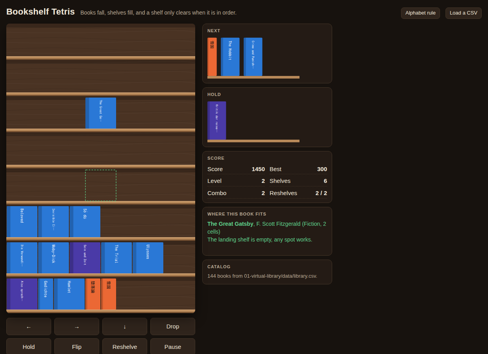

# Bookshelf Tetris

A browser game built on the virtual library (project 1). Falling pieces are books from the catalog, drawn as the same spines with the same colors, one shelf high and one to three cells wide by size band (manga, light novels and bunko narrow; art books, textbooks and anthologies wide; the rest medium). A full shelf clears only when its titles read left to right in the library's shelving order, where titles beginning with "The" are grouped after S. A full shelf that is out of order stays, tinted red, until a "reshelve" sorts it (limited uses, costs points). Plain HTML and JavaScript, no packages, no build step, no network beyond fetching the catalog CSV.



## How to run

Served (recommended, the page then loads the project 1 catalog by itself):

```
cd /home/user/side-projects
python3 -m http.server 8000
```

Then open <http://localhost:8000/17-bookshelf-tetris/>.

The game tries `../01-virtual-library/data/my-library.csv` first (the real export, made with `python3 import_xlsx.py catalog.xlsx` in project 1 and never committed), then the sample `../01-virtual-library/data/library.csv`. Add `?catalog=sample` to the URL to force the sample. Rows with Status `Not a book`, `Unreadable` or `Partial` are never dealt, so the real catalog gives 861 playable books out of 987 rows. When the real export is absent the browser logs one 404 for it before the sample loads; that is expected.

Opened directly as a file (double-click `index.html`): browsers block `fetch` on `file://`, so the game uses a built-in sample of 30 books. "Load a CSV" in the header opens a file picker that accepts any CSV in the project 1 schema (`Title`, `Type`, `Genre`, `Language`, `Status`, and so on; the column mapping is `Library.CONFIG.columns` in `../01-virtual-library/library.js`).

Verification (needs `pip install playwright` and a Chromium build):

```
cd /home/user/side-projects/17-bookshelf-tetris
python3 verify.py
```

## How to play

| Key | Action |
|---|---|
| Left, Right | move the book |
| Down | soft drop (1 point per shelf) |
| Space | hard drop (2 points per shelf) |
| C or Shift | hold, or swap with the held book (once per book) |
| F or Up | flip the spine text (cosmetic, the grid is unchanged) |
| R | reshelve: sort one full misordered shelf into order |
| P or Esc | pause |
| H or ? | the alphabet rule, with an example shelf |
| Enter | start, or play again |

The same actions are on the buttons under the board for touch screens.

Rules and scoring:

- Width: `Library.sizeBand` gives `small`, `medium` or `large` from the Type column (and a bunko publisher), mapped to 1, 2 or 3 cells by `CONFIG.widthBands`. If the catalog has a `Pages` column it wins: under 200 pages is 1 cell, under 500 is 2, otherwise 3.
- A shelf clears when all 12 cells are filled and the books, read left to right, are in shelving order (`Library.sortKeyOf`, so "The Trial" must sit after "Sein und Zeit" and before "Tristram Shandy"; a filled `sort_title` is honored). Equal keys are allowed.
- Clearing a shelf scores 100 times the level, plus 50 times the level if that shelf was never reshelved (the "one pass" bonus). Clearing on consecutive locks builds a combo worth 50 times the level per extra step.
- A full misordered shelf is tinted red and stays. Press R to reshelve it: the shelf is sorted, then clears without the one-pass bonus. Reshelving costs 300 points (the score never goes below zero) and is limited to 2 uses per level, refilled at each level. With several misordered shelves, R opens a selection: Up and Down choose, R or Enter confirms, Esc cancels.
- The side panel shows where the falling book fits on the shelf it would land on: green markers mean the neighbors on that side are in order, red means not, and a gold triangle marks where the book belongs. The hint text names the book's type and width and says which title it should file before or after.
- Level rises every 5 shelves and the fall interval shrinks by 15 percent per level (800 ms at level 1, never below 110 ms).
- The game ends when a new book cannot be placed on the top shelf. The best score is kept in `localStorage`.

## File layout

```
17-bookshelf-tetris/
  index.html      markup, stylesheet, overlays and touch buttons
  game.js         the game: CONFIG, catalog and bag, grid rules, rendering, input, test hook
  verify.py       Playwright check that also writes screenshot.png
  screenshot.png  the board mid-game, for this README
  README.md
```

The page loads `../01-virtual-library/library.js` for CSV parsing, the sort key, the size bands, the palette and `drawSpine`. Nothing in project 1 is modified. Spines are drawn by `Library.drawSpine` with a `size` option that pins the width and height to the cell size, so the palette and typography stay identical to the shelf view.

`window.__game` exposes the state, `grid()` (titles per cell), `placeRow(row, titles)`, `setPiece(title, col)`, `bookWidth(book)`, `fall()`, `hardDrop()`, `resolveRows()`, `reshelve(row)` and `handleKey(key)`. `verify.py` opens the page with `?catalog=sample` and uses these to build ordered and misordered shelves deterministically and check what clears; when the real export exists it also checks that the game loads it by default and starts.

## Assumptions

- The board is 12 cells wide and 8 shelves high. Both are in `CONFIG` at the top of `game.js`, with the cell size, speeds, points and reshelve limits.
- Widths come from the Type band because the catalog has no page count: fiction, philosophy, history and most other types are 2 cells, manga and poetry 1, art books and textbooks 3. The band table is `CONFIG.spine.typeBands` in `library.js`; the cells per band are `CONFIG.widthBands` in `game.js`.
- The catalog has 51 Harvard Classics volumes, so `CONFIG.bagRules` limits titles matching `^Harvard Classics, Vol` to 3 per bag (one bag is one shuffled pass through the catalog). Remove the rule to deal the whole catalog evenly.
- Ordering uses `sort_title` when the CSV has it, otherwise `title`, exactly as project 1 does. Japanese titles therefore sort after all Latin titles by code point, which is easy for the player but is not how the Japanese shelves are actually arranged (they are not alphabetized).
- Objects, unreadable and partial rows are skipped because their titles are descriptions, not titles.
- Rows above a cleared shelf shift down as whole shelves (standard Tetris gravity). Books do not fall individually into gaps.
- The falling book cannot be rotated because spines are always upright on a shelf; the flip key only mirrors the text.
- On `file://` the fetch is skipped rather than attempted, since browsers log a console error for it. The 30-book sample is a subset of the catalog chosen so the game and the tests behave the same either way.

## Ideas for later

- A "series" mode where volume numbers sort numerically, so Harvard Classics Vol. 2 files before Vol. 10 (the string key currently puts 10 first, like the shelf view does).
- A "one shelf" mode that deals only the books of a chosen real shelf, so a cleared board means that shelf is in order.
- Per-book gravity after a clear, so books drop into gaps and can accidentally form ordered shelves.
- A daily seed so two players get the same sequence of books.
- Sound: a soft thud on lock and a page flip on clear.
